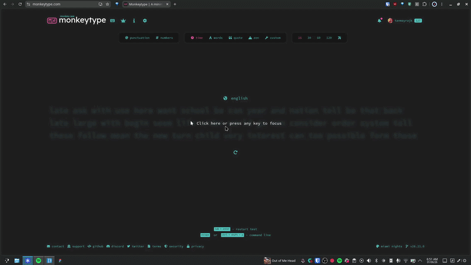

# chromand palette

i really like the zen command's palette so this is a heavily inspired version i made for chromium based browsers. atm you can search your history, bookmarks and tabs with it. it also supports search engines (custom ones too!) and bangs (similar to [helium bangs](https://helium.computer/bangs)). eventually i wanna make it much faster (pretty slow atm) and add more features like maths and other stuff.

---

## how to use

`alt + k` to open the palette. `alt +k` or `esc` to close it. `tab` and `shift + tab` to navigate. add bangs and search engines in the options page of the extension. to use a bang, press `/` and start typing the shorthand of the bang, `enter` to select it and then type the value and then `enter` to search it.

---

## how to install

- download the latest version from releases
- unzip it
- drag the unzipped folder onto your browser's extension page (make sure developer mode is on).

---

## how to build

- download the repo from github
- install [deno](https://deno.com/)
- run `deno task build` in the repo
- drag it onto your browser's extension page (make sure developer mode is on).

---

## license

mit do whwatever you want.
